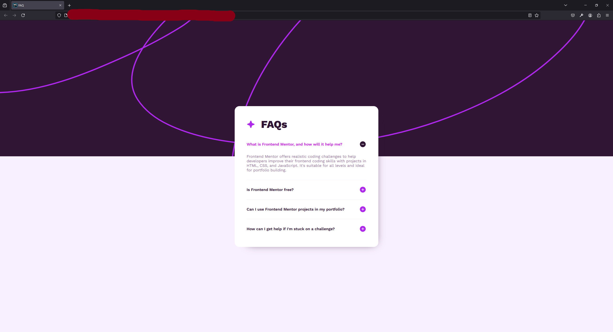
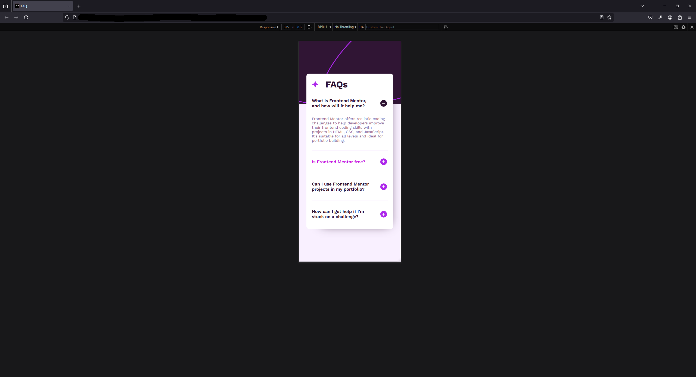

# Frontend Mentor - FAQ accordion

This is a solution to
the [FAQ accordion](https://www.frontendmentor.io/challenges/faq-accordion-wyfFdeBwBz).
Frontend Mentor challenges help you improve your coding skills by building realistic projects.

## Table of Contents

- [What I learned](#What-I-Learned)
- [Screenshot #1](#PC-version)
- [Screenshot #2](#Mobile-version)
- [Project Link](#Project-Link)

### What-I-Learned

During this project I've learnt the most of all 3 I've done on Frontend Mentor. It gave me more understanding
of JS overall since I'm new into it. It also gave me some basic understanding of JS/CSS transitions and how to
communicate between JS/CSS to make them out. Overall, in my opinion, that's an amazing challenge to start with
JS if you already know something about both HTML and CSS. At least that's how it worked for me ;)

### PC-version

### Mobile-version

### Project-Link

Link